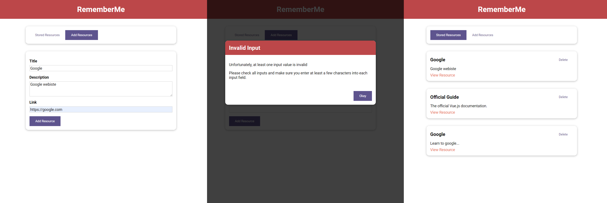

# The Learning Resources App - Udemy Vue Course

## Description

This repository contains the project "The Learning Resources App" developed as part of the [Vue - The Complete Guide (incl. Router & Composition API)](https://www.udemy.com/course/vuejs-2-the-complete-guide/) course on Udemy. The Learning Resources App is a web application that allows users to discover and share various learning resources such as articles, tutorials, videos, and books related to different topics and technologies.

## Features

- **Add Resources:** Users can add new educational resources by filling out a form that includes the title, description, resource type (article, video, book, etc.), and the URL of the resource.
- **Browse Resources:** Users can browse all the added resources in the form of cards with basic information about each resource. By clicking on a card, users can view more details about the selected resource.
- **Delete Resources:** Users can delete resources that are no longer needed.

## Technologies Used

- HTML5 and CSS3 for the user interface.
- Vue.js for the application's logic and dynamic data binding.
- The project was developed following modern Vue.js practices, including the Composition API.

## Installation and Running

1. Clone this repository to your computer using `git clone`.

2. Navigate to the project directory.

3. Install the necessary dependencies using `npm install`.

4. Start the development server using `npm run serve`.

## Project Structure

The project follows a structured organization:

- `app.vue`: The main Vue component containing the root of the application.
- `components`: A directory containing reusable Vue components used in the app.

## Credits

The Learning Resources App was created as part of the [Vue - The Complete Guide (incl. Router & Composition API)](https://www.udemy.com/course/vuejs-2-the-complete-guide/) course on Udemy, instructed by [Maximilian Schwarzmüller](https://www.udemy.com/user/maximilian-schwarzmuller/). The design, code, and concepts are based on the course content.
